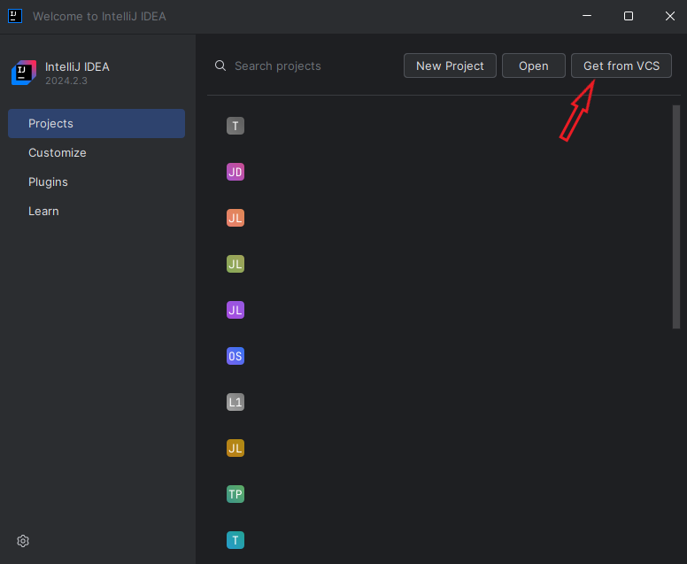
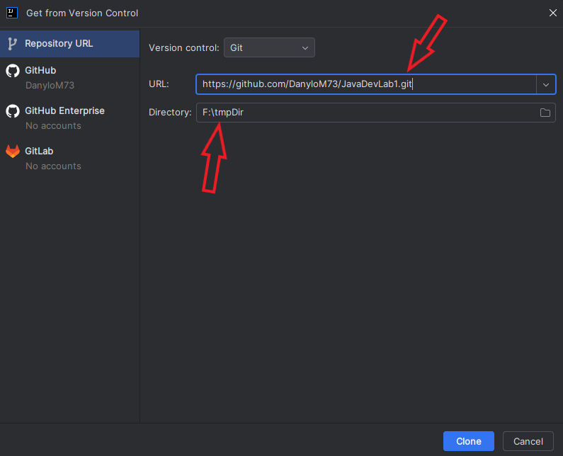
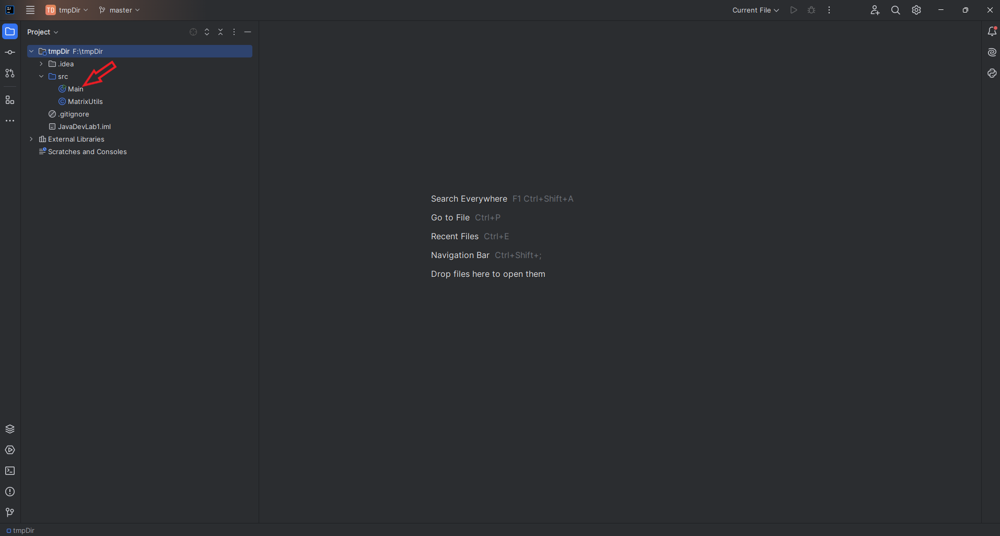
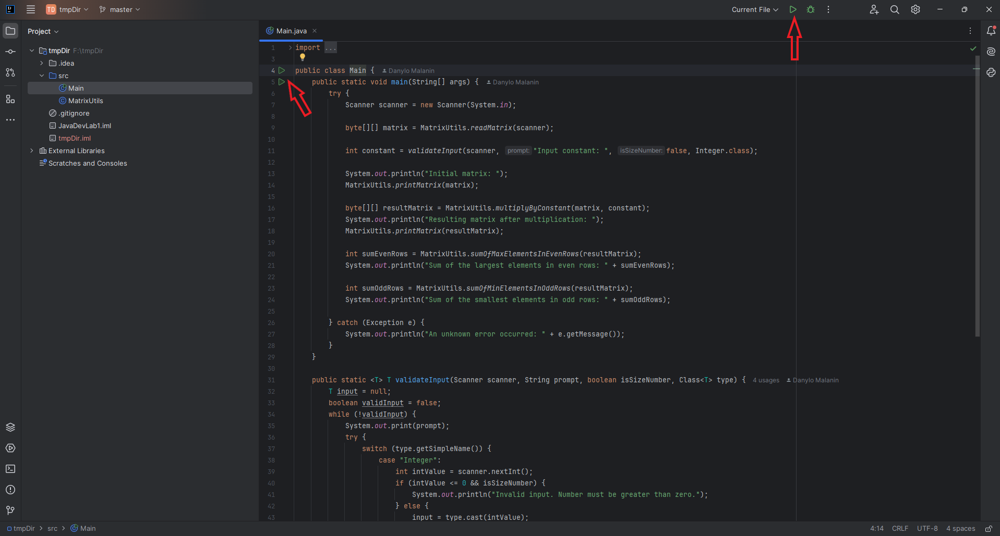
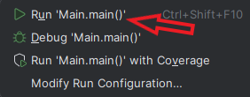
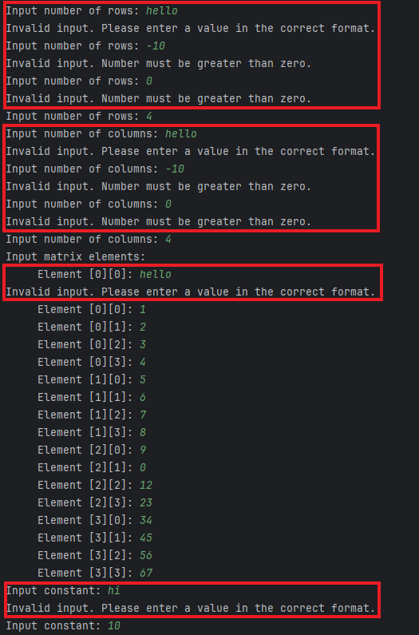
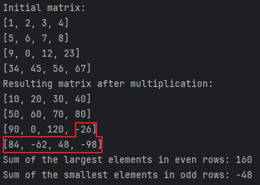

# Розробка програмного забезпечення на платформі Java

## Лабораторна робота №1

### Інструкція зі встановлення та першого запуску

_Застосунок було написано в Intellij IDEA, тому тут буде надана інструкція з інсталювання додатка саме через цю IDE._

1. **Клонувати цей репозиторій на свою локальну машину.**

У початковому вікні Intellij IDEA треба натиснути кнопку `Get from VCS`.

У наступному вікні потрібно вказати посилання на цей репозиторій та шлях до директорії, у якій цей репозиторій буде клоновано.

2. **Запустити додаток.**

Треба відкрити файл `Main.java`.

Тоді стануть доступними кнопки для запуску додатка.

При натисканні кнопки запуску зліва від коду в діалоговому вікні потрібно вибрати перший пункт.

### Інформація щодо роботи додатка

Додаток може обробляти дані, що користувач вводить при роботі. Для розмірності матриці стоїть обмеження на те, що ці числа не можуть бути від'ємними, а також словами. Елементи матриці та константа також не можуть бути словами. 

Варто зауважити, що додаток працює з матрицями типу **byte**. Через це може виникнути певна неочікувана робота програми, але вона пов'язана з особливістю роботи з цим типом даних у Java. 
